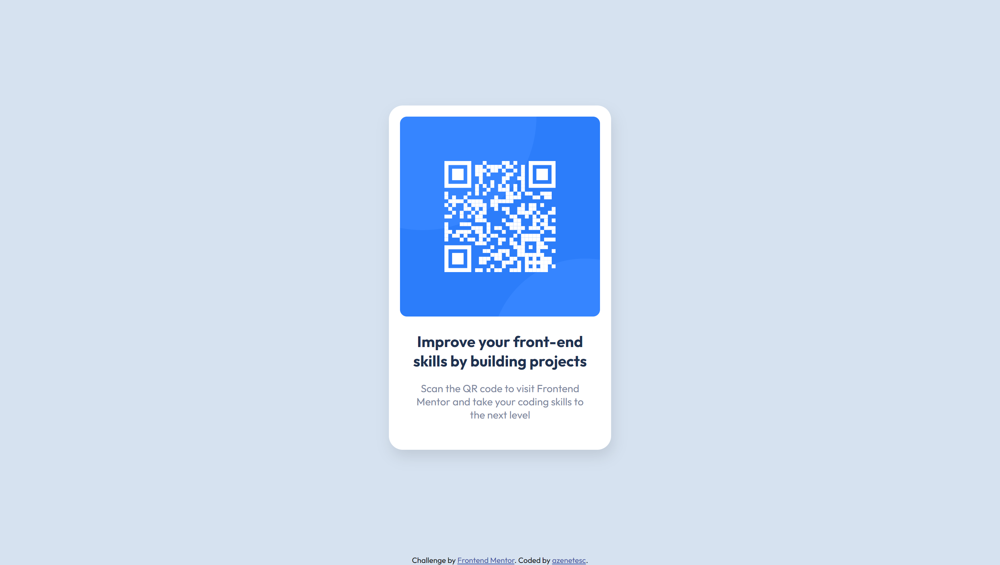

# Frontend Mentor - QR code component solution

This is a solution to the [QR code component challenge on Frontend Mentor](https://www.frontendmentor.io/challenges/qr-code-component-iux_sIO_H).

## Table of contents

- [Overview](#overview)
  - [Screenshot](#screenshot)
  - [Links](#links)
- [My process](#my-process)
  - [Built with](#built-with)
  - [Useful resources](#useful-resources)
- [Author](#author)
- [Acknowledgments](#acknowledgments)

## Overview

### Screenshot

<h3>Desktop</h3>

<h3>Mobile</h3>

### Links

- Solution URL: [FrontEnd Mentor: My Solution](https://github.com/azenetesc/qr-code-component)
- Live Site URL: [GitHub Page: QR Card Component](https://azenetesc.github.io/qr-code-component/)

## My process

### Built with

- Semantic HTML5 markup
- SASS
- Flexbox
- BEM
- Mobile-first workflow

### Useful resources

- [BEM Cheat Sheet](https://9elements.com/bem-cheat-sheet/) - This helped me understand BEM

## Author

- Frontend Mentor - [@azenetesc](https://www.frontendmentor.io/profile/azenetesc)
